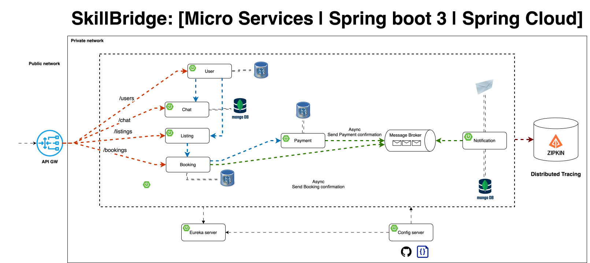

# 🏠 Skill Bridge — Microservices Marketplace

A full-stack home services marketplace platform (plumbing, electrical, etc.) built with a microservices architecture using Spring Boot, Kafka, PostgreSQL, and MongoDB. Clients can post service listings, technicians submit proposals, and the platform manages the full intervention lifecycle.

---

## 🏗️ Architecture Overview



```
├── config-server          # Centralized configuration
├── discovery-service      # Eureka service registry
├── gateway-service        # API Gateway (routing + auth filter)
├── user-service           # Users, profiles, roles, auth
├── listing-service        # Listings, applications, proposals
├── intervention-service   # Interventions & technician agenda
├── payment-service        # Payments via Stripe (Kafka producer)
├── chat-service           # Per-intervention chat rooms
├── notification-service   # Event-driven email/SMS/push notifications
└── batch-service          # Scheduled jobs & AI-powered reports
```

**Tech Stack:** Spring Boot · Spring Cloud · Kafka · PostgreSQL · MongoDB · Spring Security (JWT) · Spring Batch · OpenFeign · Docker

---

## 🧠 System Design

### Infrastructure Services

- **Config Server** — Centralized configuration management using a Git-based repository. Provides environment-specific settings for all services.
- **Discovery Service (Eureka)** — Service registry that allows microservices to find and communicate with each other dynamically without hardcoded IPs.
- **API Gateway** — Single entry point for the system. Handles request routing, authentication, and rate limiting.

### Business Services

- **User Service** — Manages authentication, authorization, and user profiles (CLIENT / TECHNICIAN / SUPPORT / ADMIN).
- **Listing Service** — Handles job post creation, hierarchical categories, and the application/bid process.
- **Chat Service** — Facilitates real-time negotiation between clients and technicians once an application is accepted.
- **Intervention Service** — Manages the service contract — visit proposals, scheduling, and intervention lifecycle tracking.
- **Payment Service** — Securely processes visit fees and job payments via Stripe.
- **Notification Service** — Event-driven service consuming Kafka topics to send emails, SMS, and push notifications asynchronously.
- **Batch Service** — Scheduled jobs for reporting, data cleanup, and AI-generated technician summaries.

### Design Patterns

- **Database-per-Service** — Each service owns its data store (PostgreSQL or MongoDB)
- **Event-Driven Communication** — Async inter-service events via Kafka
- **Synchronous Communication** — OpenFeign for direct service-to-service REST calls
- **Gateway Pattern** — Single entry point with JWT validation before routing

---

## 🔄 Core Event Flow

```
Client posts a Listing
        ↓
Technician submits an Application to the Listing
        ↓
Client accepts the Application
        ↓
A Chatroom is created (Client ↔ Technician negotiate)
        ↓
Technician submits a Proposal (visit date + price)
        ↓
Client accepts Proposal → initiates Payment (visit fee)
        ↓
Payment confirmed (Stripe webhook)
        ↓
Payment Service publishes ProposalPaidEvent (Kafka)
        ↓
Intervention Service consumes event → creates Intervention
        ↓
Technician sees Intervention in their Agenda
        ↓
Technician starts Intervention
        ↓
Technician completes Intervention (optionally requests extra fee)
        ↓
Client confirms completion (or pays extra fee if requested)
        ↓
Intervention marked as completed → Listing archived
        ↓
(Weekly) Batch job aggregates Interventions → AI generates report
```

---

## ✅ Roadmap

### Phase 1 — Core Infrastructure

- [x] Config Server (Spring Cloud Config)
- [x] Discovery Service (Eureka)
- [x] Gateway Service (Spring Cloud Gateway)

---

### Phase 2 — User Service

- [x] User entity, repository, service, controller
- [x] User Profile entity (with role: CLIENT, TECHNICIAN, SUPPORT, ADMIN)
- [x] Register endpoint
- [x] Login endpoint (returns JWT)
- [x] Spring Security — JWT filter chain
- [x] Secure endpoints by role via Gateway
- [x] Propagate JWT to downstream services (OpenFeign interceptor)
- [x] Implement unit tests and integration tests

---

### Phase 3 — Listing Service

- [x] Listing entity, repository, service, controller
- [x] Application entity (technician applies to a listing)
- [x] Proposal entity (technician offers a visit/quote to client)
- [x] Implement unit tests and integration tests
- [ ] AI-powered listing auto-categorization on creation
- [ ] AI-powered proposal price suggestion for technicians

---

### Phase 4 — Intervention Service

- [x] Intervention entity, repository, service, controller
- [x] Kafka consumer — listens for `ProposalPaidEvent` to create intervention
- [x] Technician agenda (list of interventions)
- [x] OpenFeign integration with User Service for technician data
- [x] Intervention status transitions (started → completed)
- [ ] Extra fee request flow
- [ ] Client confirmation of completion

---

### Phase 5 — Payment Service

- [ ] Payment service setup (Spring Boot)
- [ ] Stripe integration (test mode)
- [ ] Payment intent creation endpoint (visit fee)
- [ ] Stripe webhook handler (payment confirmed)
- [ ] Kafka producer — publishes `ProposalPaidEvent` on successful payment
- [ ] Extra fee payment flow
- [ ] Link payment to proposal

---

### Phase 6 — Chat Service

- [ ] Chat service setup (Spring Boot + MongoDB)
- [ ] WebSocket configuration
- [ ] Chatroom created on application acceptance (Kafka event)
- [ ] Per-intervention chat rooms
- [ ] Message persistence (MongoDB)
- [ ] Unread message count per user

---

### Phase 7 — Notification Service

- [ ] Notification service setup (Spring Boot)
- [ ] Kafka consumer for notification events
- [ ] Email notifications (application accepted, proposal received, payment confirmed, etc.)
- [ ] SMS notifications (optional)
- [ ] Push notifications (optional)

---

### Phase 8 — Spring Batch & AI Reports

- [ ] Batch service setup
- [ ] Weekly job: aggregate completed interventions per technician
- [ ] Weekly job: calculate technician earnings summary
- [ ] AI-generated natural language summary of weekly report (per technician)
- [ ] Inactive listing expiry job (auto-close listings with no proposals after X days)
- [ ] Admin data export job (CSV/PDF)

---

### Phase 9 — Polish & MVP Completion

- [ ] End-to-end smoke test (register → listing → proposal → payment → intervention → completion)
- [ ] Docker Compose setup for full local stack
- [ ] API documentation (Swagger / SpringDoc)
- [ ] Project README with setup instructions
- [ ] Postman collection for full user journey demo

---

## 🚀 Getting Started

> ⚠️ Setup instructions coming in Phase 9.

---

## 📌 Notes

- Authentication is JWT-based, validated at the Gateway level
- Inter-service communication uses OpenFeign for sync calls and Kafka for async events
- MongoDB is used for chat message storage; PostgreSQL for all other services
- AI features use the Anthropic/OpenAI API (TBD) for listing categorization and report summarization
