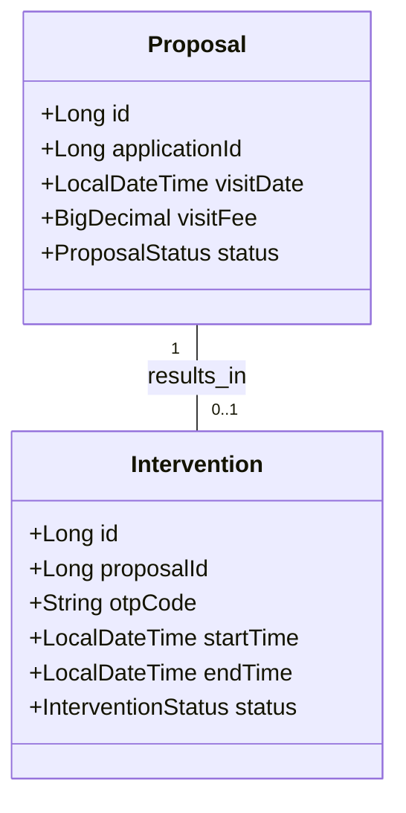

```mermaid

classDiagram
    class Proposal {
        +Long id
        +Long applicationId
        +LocalDateTime visitDate
        +BigDecimal visitFee
        +ProposalStatus status
    }

    class Intervention {
        +Long id
        +Long proposalId
        +String otpCode
        +LocalDateTime startTime
        +LocalDateTime endTime
        +InterventionStatus status
    }

    Proposal "1" -- "0..1" Intervention : results_in

```
