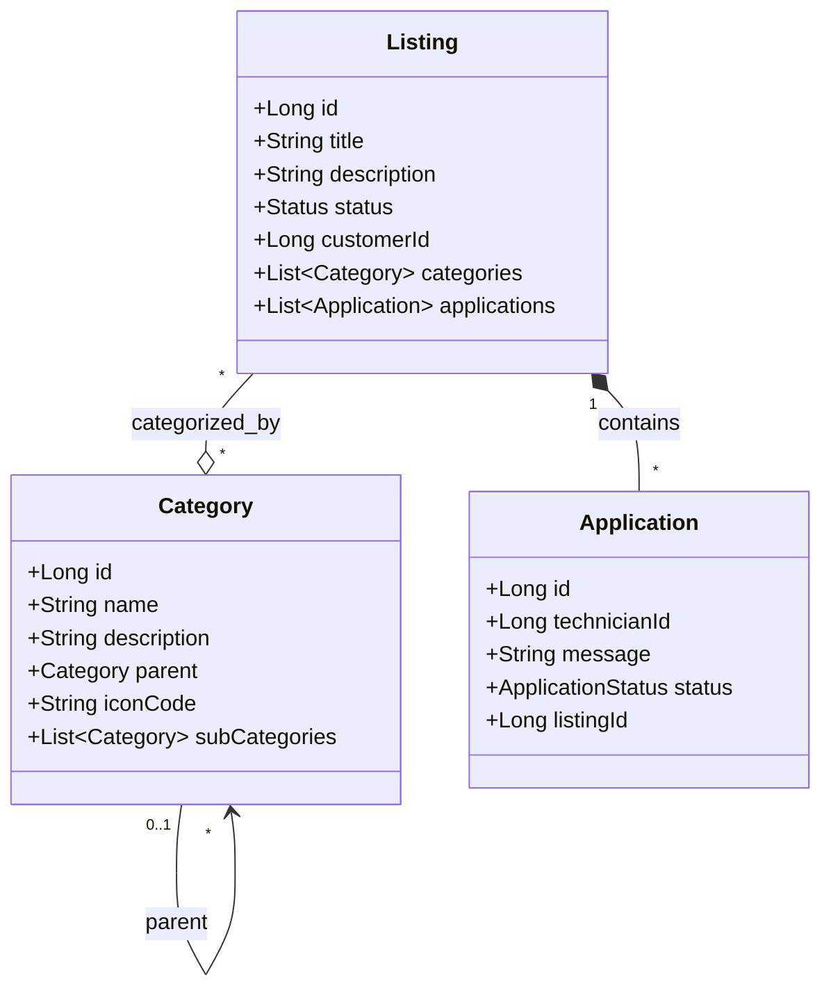

# 📊 Data Models

### Listing Service Entities

```mermaid
classDiagram
    class Category {
        +Long id
        +String name
        +String description
        +Category parent
        +String iconCode
        +List~Category~ subCategories
    }

    class Listing {
        +Long id
        +String title
        +String description
        +Status status
        +Long customerId
        +List~Category~ categories
        +List~Application~ applications
    }

    class Application {
        +Long id
        +Long technicianId
        +String message
        +ApplicationStatus status
        +Long listingId
    }

    Category "0..1" --> "*" Category : parent
    Listing "1" *-- "*" Application : contains
    Listing "*" --o "*" Category : categorized_by
```
