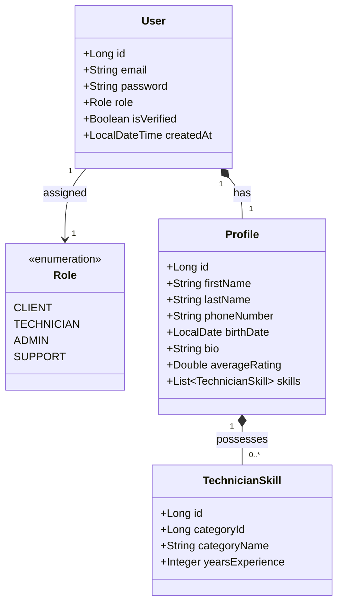

```mermaid
classDiagram
    class User {
        +Long id
        +String email
        +String password
        +Role role
        +Boolean isVerified
        +LocalDateTime createdAt
    }

    class Role {
        <<enumeration>>
        CLIENT
        TECHNICIAN
        ADMIN
        SUPPORT
    }

    class Profile {
        +Long id
        +String firstName
        +String lastName
        +String phoneNumber
        +LocalDate birthDate
        +String bio
        +Double averageRating
        +List~TechnicianSkill~ skills
    }

    class TechnicianSkill {
        +Long id
        +Long categoryId
        +String categoryName
        +Integer yearsExperience
    }

    User "1" *-- "1" Profile : has
    User "1" --> "1" Role : assigned
    Profile "1" *-- "0..*" TechnicianSkill : possesses
```
